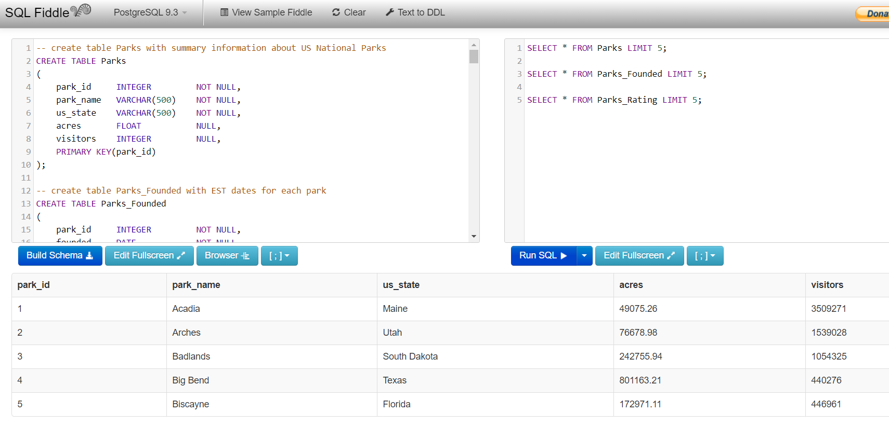

# US National Park Schema Generator
Generate simple tables with SQL for use in SQL Fiddle
- Created: 1/8/20
 
## About the Data:
The data in the Schema contains details about 58 US National Parks:
- name
- state
- acres
- 2017 visitors
- date founded
- longitude
- latitude
- visitor rating
- number of tent campers

## Using this Repository to practice SQL:
1. Copy the SQL code from the file: https://raw.githubusercontent.com/odonnell31/NPS_Schema_Generator/main/SQL/build_NPS_tables.sql
2. Go to www.sqlfiddle.com
3. Paste the SQL code into the left hand side of the SQL Fiddle window
4. Change the SQL drop-down menu on the top left from "MySQL 5.6 to "PostgreSQL 9.3"
5. Click "Build Schema"
6. Practice SQL commands on the right side of the SQL Fiddle window

